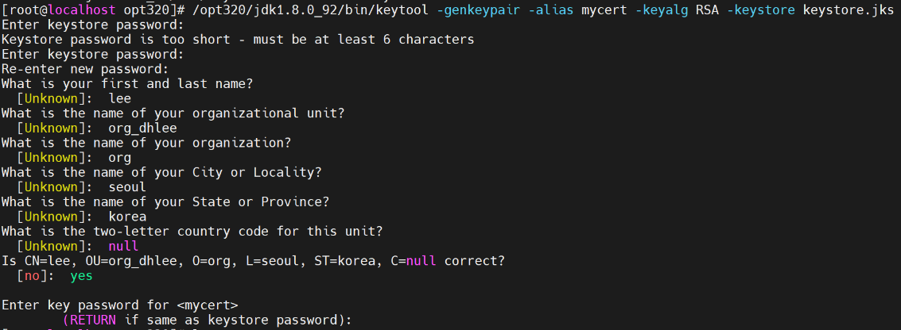

# SSL/TLS

## ssl와 tls 용어는 왜 같이 쓰일까? 다른 것일까?

| 특징             | SSL (Secure Sockets Layer) | TLS (Transport Layer Security) |
|------------------|---------------------------|--------------------------------|
| 역사             | SSL는 초기 웹 보안 프로토콜로 시작됨. SSL 3.0은 초기 버전. | TLS는 SSL 3.0을 기반으로 개발됨. TLS 1.0부터 시작.  |
| 목적             | 네트워크 통신에서 데이터 보안 및 기밀성 제공.   | 네트워크 통신의 보안, 안전성, 데이터 무결성, 인증을 위해 개발. |
| 버전             | SSL 3.0 (마지막 SSL 버전) | TLS 1.0 (SSL 3.1), TLS 1.1, TLS 1.2, TLS 1.3 등이 있음. |
| 보안 개선        | SSL에 비해 초기 버전에서 취약점 발견됨. 보안 개선이 필요. | TLS는 SSL에서 발견된 취약점을 개선하고 다양한 보안 기능을 제공함. |
| 현재 사용량      | 현재 웹 브라우징 및 다른 네트워크 애플리케이션에서는 거의 사용되지 않음. | TLS 1.0 이상의 버전이 현재 네트워크 통신에서 널리 사용됨. |
| 보안 프로토콜    | SSL 3.0 이전 버전에서는 주로 SSL로 알려짐. | TLS 1.0 이후 버전에서는 주로 TLS로 알려짐. |


## jks 생성 방법

이 글에서는 Java를 사용하여 SSL 인증서를 만들었습니다. SSL 인증서는 웹 서버에서 안전한 통신을 위해 사용되며, Java 키스토어와 키 툴을 사용하여 이 작업을 수행할 수 있습니다.

**단계 1: 키페어 생성**
먼저, 공개 키와 개인 키를 생성해야 합니다. 다음 명령어를 사용하여 키페어를 생성할 수 있습니다. 여러가지 질문이 나타나는데 알맞게 구성하여 완성합니다.
```shell
keytool -genkeypair -alias mycert -keyalg RSA -keystore keystore.jks
```

<br>

**단계 2: 키페어 내보내기 (옵션)**
생성한 키페어를 다른 서버에 설치하려면 키페어를 내보낼 수 있습니다. 다음 명령어를 사용하여 키페어를 내보내고 공개 키를 다른 서버에 복사할 수 있습니다.

```shell
keytool -export -alias mycert -keystore keystore.jks -file mycert.crt
```
<br>

**단계 3: 키페어 확인 (옵션)**
키페어와 인증서를 확인하려면 다음 명령어를 사용합니다.

```shell
keytool -list -v -keystore keystore.jks
```