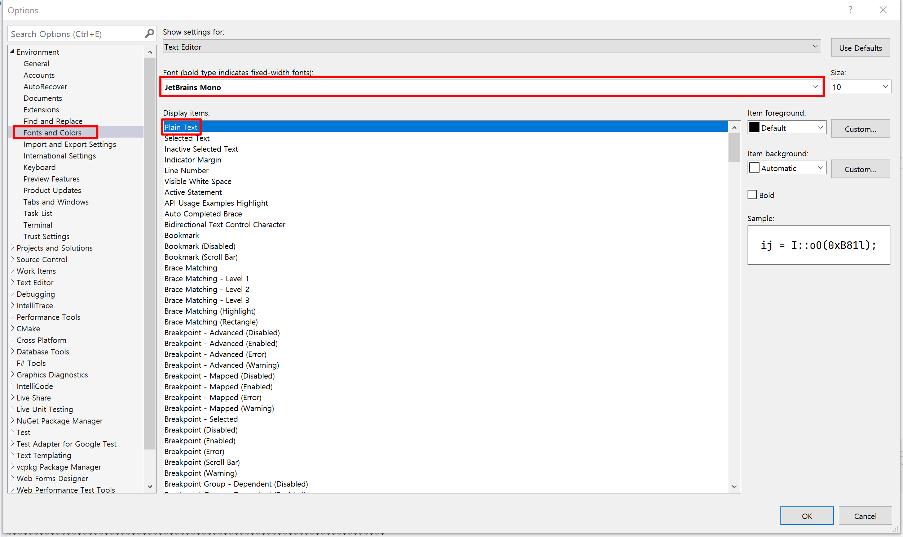
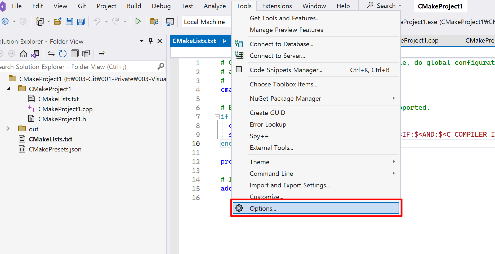
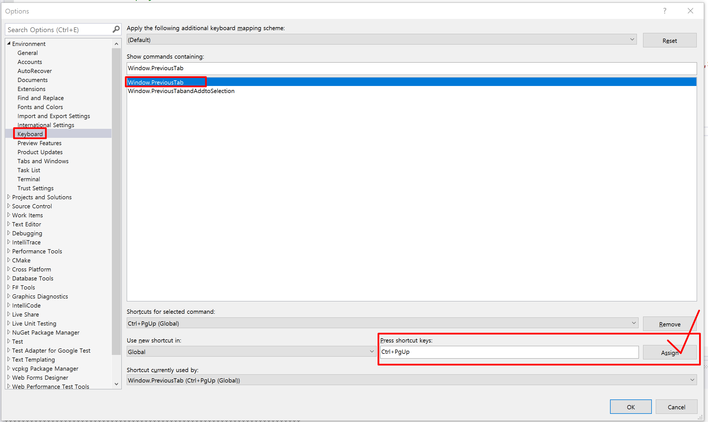
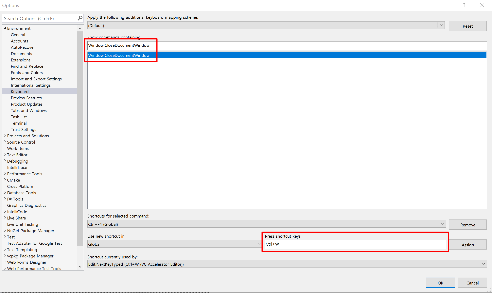

# Visual Studio Custom Settings

## 1. 일반 설정
### 1-1. Text Editor 폰트 설정
  

### 1-2. Resharper

## 2. 키 세팅
### 2-1. 탭 전환  
`Ctrl` + `PgUp/PgDown` : Window.PreviousTab   

이 키가 작동되도록 하기 위해서는 충돌 나는 키와 트레이드 오프 해야합니다.

### 2-2. 탭 닫기
`Ctrl` + `W`: Window.CloseDocumentWindow

이 키가 작동되도록 하기 위해서는 충돌 나는 키와 트레이드 오프 해야합니다.

