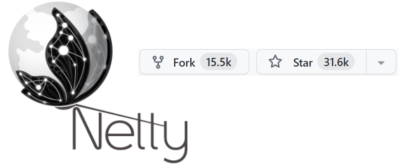

# Http Server with Netty framework 구성

## 1. Http Server는 Third-part 제품 없이도 구성이 가능한가?  
Netty를 사용하여 서버를 구성할 때에는 Tomcat이나 제3의 라이브러리나 프레임워크 없이도 서버를 구성할 수 있습니다.  
Netty는 저수준의 네트워크 프레임워크로서 HTTP 서버와 다양한 다른 프로토콜을 구현하고 다루는 데 사용될 수 있습니다.

하지만 이렇게 저수준의 네트워크 라이브러리를 사용할 경우, 서버의 구성과 관리는 개발자에게 맡겨지며 몇 가지 고려사항을 고려해야 할 수 있습니다:

1. **라우팅 및 핸들링 구현**: REST API의 엔드포인트 라우팅과 요청 핸들링은 직접 구현해야 합니다. Netty의 채널 파이프라인을 이용하여 요청을 처리하고 적절한 핸들러로 라우팅해야 합니다.

2. **HTTP 파싱 및 응답 생성**: HTTP 요청의 파싱과 응답 생성 역시 직접 구현해야 합니다. 요청과 응답의 헤더 및 바디를 처리하는 로직을 작성해야 합니다.

3. **스레드 관리**: Netty는 비동기 및 이벤트 기반 프레임워크로, 스레드 관리에 신경을 써야 합니다. 요청 처리를 위한 스레드 풀을 관리하고 동기화된 작업을 처리해야 합니다.

4. **보안 및 인증**: 보안 및 인증 등에 대한 기능은 직접 구현해야 합니다. HTTPS를 지원하거나 사용자 인증과 권한 부여를 처리하는 기능을 개발해야 합니다.

5. **성능 및 확장성**: 성능 및 확장성을 고려하여 적절한 디자인을 적용해야 합니다. 요청의 처리량이 높을 경우 적절한 아키텍처를 구성하는 것이 중요합니다.

Tomcat이나 다른 제3의 라이브러리를 사용하는 것보다 더 많은 직접적인 작업이 필요할 수 있지만, 특정한 요구사항에 따라 세밀한 컨트롤을 원한다면 Netty를 활용하여 서버를 구성하는 것도 가능합니다.

### - 간단 비교 : tomcat과 netty
Tomcat과 Netty는 둘 다 HTTP 서버를 구성하고 REST API를 구현하는 데 사용할 수 있는 도구이지만, 각각의 특징과 장단점이 있습니다. 아래에서는 Tomcat과 Netty를 비교하여 REST API를 구성하는 점에 대해 설명해드리겠습니다.

**Tomcat:**

1. **성숙한 웹 컨테이너**: Tomcat은 오랜 기간 동안 개발 및 사용된 성숙한 웹 컨테이너입니다. Java EE 및 Servlet 표준을 준수하며, 많은 기능과 라이브러리를 내장하고 있습니다.

2. **상대적으로 쉬운 설정**: Tomcat은 다양한 설정 파일과 웹 애플리케이션 배치를 쉽게 설정할 수 있습니다. XML 파일을 통해 애플리케이션을 구성하고 배치할 수 있습니다.

3. **스레드 관리 및 성능**: Tomcat은 스레드 풀을 사용하여 요청을 처리하며, 스레드 풀의 크기를 조정하여 동시 요청을 다룰 수 있습니다. 하지만 많은 스레드가 필요한 상황에서 확장성이 제한될 수 있습니다.

4. **서블릿 기반**: Tomcat은 주로 서블릿 기술을 기반으로 하는 Java EE 웹 애플리케이션 서버입니다. 서블릿과 필터를 사용하여 요청을 처리하고 REST API를 구현할 수 있습니다.

**Netty:**

1. **고성능 및 비동기 처리**: Netty는 비동기 및 이벤트 기반 아키텍처로 높은 성능을 제공합니다. 많은 동시 요청을 효율적으로 처리할 수 있으며, 대량 트래픽을 관리하는 데 적합합니다.

2. **커스터마이징 가능**: Netty는 저수준 네트워크 프레임워크로서 프로토콜과 요청 처리를 완전히 커스터마이징할 수 있습니다. 이로써 특정한 요구사항을 충족시킬 수 있습니다.

3. **다양한 프로토콜 지원**: Netty는 HTTP 뿐만 아니라 다양한 프로토콜을 지원합니다. REST API뿐만 아니라 다양한 네트워크 애플리케이션을 개발할 수 있습니다.

4. **스레드 관리 및 성능**: Netty는 이벤트 루프를 통해 스레드 관리를 자체적으로 처리하며, 비동기 방식으로 요청을 처리합니다. 이로 인해 스레드 풀의 효율적인 사용을 도와 성능을 최적화할 수 있습니다.

Tomcat은 주로 대규모 웹 애플리케이션을 위해 사용되며, 설정 및 관리가 비교적 간편합니다. Netty는 성능과 커스터마이징을 중요시하는 상황에서 유용합니다. 프로젝트의 목표와 요구사항에 따라 두 옵션 중 적절한 것을 선택할 수 있습니다.

## 2. Netty framwork에서 Auth와 관련된 인터페이스 제공하는가?
Netty는 HTTP 서버를 구성할 때 인증(authentication)과 관련된 부분을 다룰 수 있는 다양한 기능과 라이브러리를 제공합니다. 하지만 인증에 대한 구체적인 구현은 프로젝트의 요구사항과 보안 정책에 따라 다를 수 있습니다. 아래는 Netty에서 인증을 다루는 방법과 관련된 내용을 요약한 것입니다.

1. **HTTP Basic Authentication**:
   Netty에서 HTTP Basic Authentication을 구현하려면 `BasicAuthenticationHandler`나 사용자 정의 핸들러를 생성하여 요청의 헤더에 있는 인증 정보를 파싱하고 검증해야 합니다. `BasicAuthenticationHandler`는 Netty의 `io.netty.handler.codec.http.HttpServerCodec`와 같은 다른 핸들러와 함께 사용될 수 있습니다.

2. **HTTPS와 SSL/TLS**:
   Netty는 HTTPS를 구현하기 위해 `SslContext`를 제공합니다. SSL/TLS를 사용하여 암호화된 연결을 설정하고 클라이언트와 서버 간의 데이터를 보호할 수 있습니다.

3. **사용자 정의 인증 처리**:
   Netty에서는 `ChannelHandler`를 구현하여 사용자 정의 인증 로직을 추가할 수 있습니다. 이 핸들러는 요청을 받아서 사용자가 제공한 인증 정보를 검증하고, 성공할 경우 요청을 처리하거나 실패할 경우 적절한 에러 응답을 반환할 수 있습니다.

4. **토큰 기반 인증**:
   JWT(JSON Web Token)와 같은 토큰 기반의 인증을 구현하는 것도 가능합니다. 요청 헤더에서 토큰을 추출하고 해당 토큰의 유효성을 검증하는 로직을 구현할 수 있습니다.

5. **세션 관리**:
   인증된 사용자의 세션 관리도 Netty에서 구현할 수 있습니다. 사용자의 세션을 식별하고, 세션 데이터를 관리하며, 만료된 세션을 처리하는 로직을 구현할 수 있습니다.

위의 내용은 Netty에서 인증을 다루는 일반적인 방법을 보여주는 것이며, 프로젝트의 특정 요구사항에 따라 세부적인 구현이 필요할 수 있습니다. Netty의 홈페이지나 문서에서 더 자세한 내용과 예제를 찾아볼 수 있습니다.

### - 위에서 말하는 JWT는 무엇인가?
JWT(JSON Web Token)는 웹 토큰을 나타내는 개방형 표준(JSON)입니다. JWT는 클레임(claim) 정보를 포함하는 JSON 객체로 구성되며, 디지털 서명 또는 암호화를 통해 인증과 데이터 전달을 보장합니다. JWT는 주로 사용자 인증과 권한 부여를 위해 사용되며, 웹 및 모바일 애플리케이션에서 토큰 기반 인증을 구현하는 데 널리 활용됩니다.

JWT의 구조는 세 가지 부분으로 나뉩니다:

1. **Header**: JWT의 유형과 사용된 암호화 알고리즘 등을 포함합니다. Header는 JSON 형식으로 표현되며, Base64 인코딩으로 인코딩됩니다.

2. **Payload(Claims)**: 실제 토큰에 포함되는 클레임 정보입니다. 클레임은 토큰에 대한 정보를 나타내며, 예를 들어 사용자 ID, 권한, 토큰 유효 기간 등을 포함할 수 있습니다. Payload 역시 JSON 형식으로 표현되며, Base64 인코딩으로 인코딩됩니다.

3. **Signature**: 토큰의 무결성과 신뢰성을 보장하기 위해 사용되는 서명입니다. Header와 Payload를 특정 암호화 키로 서명하게 되며, 이를 통해 토큰이 변조되지 않았는지를 확인할 수 있습니다.

### - 혹시 JWT는 oauth2.0과는 다른 것인가?
OAuth 2.0(Authentication Protocol)와 JWT는 서로 다른 개념입니다. OAuth 2.0은 클라이언트 애플리케이션이 사용자의 리소스에 접근하기 위한 허가를 관리하는 프로토콜이며, 주로 인증 및 인가를 위해 사용됩니다. JWT는 OAuth 2.0과 함께 사용될 수 있는 인증 수단 중 하나입니다. OAuth 2.0 프로토콜에서 발급된 액세스 토큰을 JWT 형태로 생성하여 사용하면, 클라이언트는 별도의 서버 인증 없이도 토큰을 기반으로 인증을 수행할 수 있습니다.

간단히 말해, JWT는 데이터를 안전하게 전달하고 인증을 관리하기 위한 방법 중 하나이며, OAuth 2.0과는 목적과 사용 사례가 다르지만 함께 사용될 수 있습니다.

## 3. 그럼 RestAPI Http Server 구성에 Netty가 필요한 이유는?
Netty를 선택하여 REST API 서버를 구성하는 것에는 다양한 장점이 있습니다.

1. **고성능**: Netty는 비동기 및 이벤트 기반 아키텍처를 기반으로 하여 높은 성능을 제공합니다. 이는 많은 동시 요청을 효율적으로 처리할 수 있어 대량의 트래픽을 관리하는 데 적합합니다.

2. **커스터마이징**: Netty는 저수준 라이브러리로서 프로토콜과 요청 처리를 완전히 커스터마이징할 수 있는 유연성을 제공합니다. 따라서 특정한 요구사항에 맞게 서버를 설계하고 구현할 수 있습니다.

3. **다양한 프로토콜 지원**: Netty는 HTTP 뿐만 아니라 다양한 네트워크 프로토콜을 지원합니다. 따라서 미래에 다른 프로토콜로 확장하고 싶을 때도 유용합니다.

4. **비동기 처리**: 비동기 방식으로 요청을 처리하기 때문에, 블로킹하지 않고 동시 다발적인 연결을 다룰 수 있습니다. 이는 시스템의 확장성을 높이는 데 도움이 됩니다.

5. **경량화**: Netty는 경량화된 라이브러리로 필요한 컴포넌트만 사용할 수 있도록 모듈화되어 있습니다. 따라서 필요한 기능만 선택하여 사용할 수 있습니다.

6. **자체 스레드 관리**: Netty는 이벤트 루프를 통해 스레드 관리를 자체적으로 처리합니다. 이로 인해 스레드 풀의 효율적인 사용을 도와 성능을 최적화할 수 있습니다.

7. **커뮤니티 및 생태계**: Netty는 활발한 개발자 커뮤니티와 다양한 오픈소스 프로젝트, 문서, 예제 등을 통해 풍부한 생태계를 갖추고 있습니다.

요약하면, Netty는 성능, 유연성, 커스터마이징 가능성 등 다양한 장점을 제공하여 REST API 서버를 구성하는 데 유용한 선택지가 될 수 있습니다. 그러나 복잡한 설정과 개발이 요구될 수 있으므로 프로젝트의 요구사항과 개발자의 스킬에 따라 적절히 판단하는 것이 중요합니다.

## 4. 참고용 소스
### - JDK를 이용한 Http Server Code
아래는 Java의 기본 라이브러리인 JDK만을 사용하여 간단한 HTTP 서버를 만드는 예제 코드입니다. 이 예제 코드는 Java 8 이상에서 작동합니다.

```java
import com.sun.net.httpserver.HttpServer;
import com.sun.net.httpserver.HttpHandler;
import com.sun.net.httpserver.HttpExchange;

import java.io.IOException;
import java.io.OutputStream;
import java.net.InetSocketAddress;

public class SimpleHttpServer {

    public static void main(String[] args) throws IOException {
        int port = 8080;
        HttpServer server = HttpServer.create(new InetSocketAddress(port), 0);
        server.createContext("/", new MyHandler());
        server.setExecutor(null);
        server.start();

        System.out.println("Server is listening on port " + port);
    }

    static class MyHandler implements HttpHandler {
        @Override
        public void handle(HttpExchange exchange) throws IOException {
            String response = "Hello, this is a simple HTTP server!";
            exchange.sendResponseHeaders(200, response.length());
            OutputStream os = exchange.getResponseBody();
            os.write(response.getBytes());
            os.close();
        }
    }
}
```

위의 코드는 `com.sun.net.httpserver` 패키지를 사용하여 간단한 HTTP 서버를 생성합니다. 요청이 오면 "Hello, this is a simple HTTP server!"라는 응답을 반환합니다.

### - Netty Framework를 이용한 Http Server Code
물론, 아래는 Netty를 사용하여 간단한 HTTP API 서버를 만드는 예제 코드입니다. 이 예제는 Java 8 이상에서 작동합니다.

```java
import io.netty.bootstrap.ServerBootstrap;
import io.netty.channel.ChannelFuture;
import io.netty.channel.ChannelInitializer;
import io.netty.channel.EventLoopGroup;
import io.netty.channel.nio.NioEventLoopGroup;
import io.netty.channel.socket.SocketChannel;
import io.netty.channel.socket.nio.NioServerSocketChannel;
import io.netty.handler.codec.http.HttpObjectAggregator;
import io.netty.handler.codec.http.HttpServerCodec;

public class HttpApiServer {

    public static void main(String[] args) throws Exception {
        EventLoopGroup bossGroup = new NioEventLoopGroup(1);
        EventLoopGroup workerGroup = new NioEventLoopGroup();

        try {
            ServerBootstrap bootstrap = new ServerBootstrap();
            bootstrap.group(bossGroup, workerGroup)
                    .channel(NioServerSocketChannel.class)
                    .childHandler(new ChannelInitializer<SocketChannel>() {
                        @Override
                        protected void initChannel(SocketChannel ch) throws Exception {
                            ch.pipeline().addLast(new HttpServerCodec());
                            ch.pipeline().addLast(new HttpObjectAggregator(65536));
                            ch.pipeline().addLast(new HttpApiHandler()); // Custom handler for your API logic
                        }
                    });

            ChannelFuture future = bootstrap.bind(8080).sync();
            System.out.println("Server is listening on port 8080");
            future.channel().closeFuture().sync();
        } finally {
            bossGroup.shutdownGracefully();
            workerGroup.shutdownGracefully();
        }
    }
}
```

위의 코드는 Netty를 사용하여 HTTP API 서버를 구현하는 기본적인 틀을 보여줍니다. `HttpApiHandler`는 실제로 요청을 처리하는 사용자 정의 핸들러로 구현해야 합니다.

## Reference Check
{width=50% height=50%}